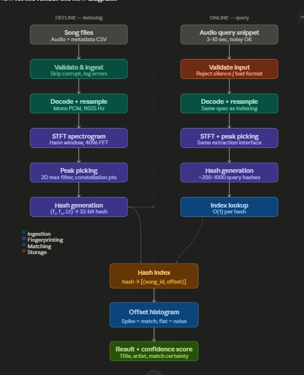
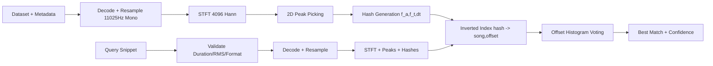

# Audio Identification & Source Detection System

> Fingerprint-based music identification system designed for low-latency retrieval, robust noisy-query matching, and clean modular architecture.

---

## Team Information
- **Team Name**: Julius Seizure
- **Year**: 2nd Year
- **All-Female Team**: No

---

## Architecture Overview

#### Describe your approach here. Keep it short and clear.

    - Phase 1 (offline indexing): ingest metadata from CSV/JSON (`song_id`, `title`, `artist`, `duration`, `genre`) with validation; invalid/corrupt rows are logged and skipped. For each song, decode to mono PCM at 11025 Hz, run Hann-window STFT (4096 FFT, 50% overlap), apply 2D local-max peak picking, then generate combinatorial fingerprint hashes by pairing anchor/target peaks and packing `(f_anchor, f_target, dt)` into a 32-bit integer.
    - Feature storage schema uses an inverted index for fast retrieval: `songs` table/dict stores metadata by `song_id`, while `fingerprints` store `hash -> [(song_id, time_offset), ...]`. Hash collisions are expected and resolved during alignment scoring; index is serialized to disk for instant startup without recomputing fingerprints.
    - Phase 2 (online query): accept 3-10 second snippet, validate format/length/silence (RMS threshold), and run the exact same extraction interface as indexing to guarantee feature-space consistency. Query hashes are looked up in O(1) average time per hash, producing candidate `(song_id, offset)` hits.
    - Matching heuristic and confidence: for each candidate song, compute `delta_t = song_offset - query_offset` and build an offset histogram. True matches form a sharp spike at one offset. Confidence is `spike_height / total_matched_hashes`, with strict acceptance thresholds (`aligned_hashes > 5` and `confidence > 0.4`) to reduce false positives; closest candidate is still returned for low-confidence fallback.

### Visual Pipeline Snapshot

| Stage | Input | Processing | Output |
|---|---|---|---|
| Offline Indexing | Song files + metadata | Resample -> STFT -> peak-picking -> hash packing | Inverted hash index |
| Online Query | 3-10s snippet | Validation -> fingerprint extraction -> index lookup | Candidate matches |
| Matching | Candidate hits | Offset histogram + confidence thresholding | Best/closest song |

### Key Design Heuristics

- **Robust alignment:** true matches create a single dominant offset spike.
- **Collision tolerance:** hash collisions are resolved by temporal consensus, not exact hash count alone.
- **Low-latency lookup:** O(1) average hash retrieval via in-memory dictionary index.
- **False-positive control:** strict thresholding (`aligned_hashes > 5`, `confidence > 0.4`) with closest-candidate fallback.

**Note:** Please do not change the format or spelling of anything in this README. The fields are extracted using a script, so any changes to the structure or formatting may break the extraction process.
